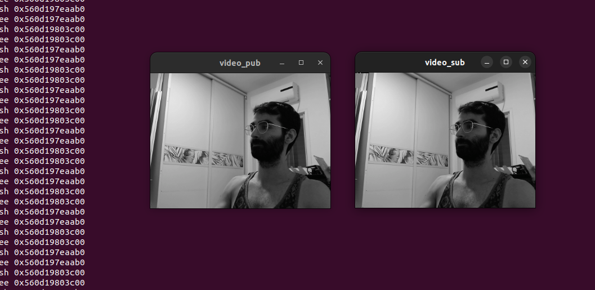

# Streaming Video over Ros2 node Pub Sub 

This repo show an example of how to stream video with Gstreamer from Live source 
in this Project there are two ros2 node video_sub and video_pub 

### to run the example

#### Install the Repo 
1. clone the repo 
2. enter to repo folder 
3. run commands :
```
rosdep install -i --from-path src --rosdistro humble -y
colcon build
source ./install/setup.bash
``` 

#### Run the example 
1. connect USB camera to device ( currently the example works with live inputs )
2. run the Publisher node 
```
source ./install/setup.bash
ros2 run video_pub video_pub
```
3. open new terminal and run the Subscriber node :
```
source ./install/setup.bash
ros2 run video_sub video_sub 
```


### System 

OS : ubunru 22.04
ROS relese : humble



